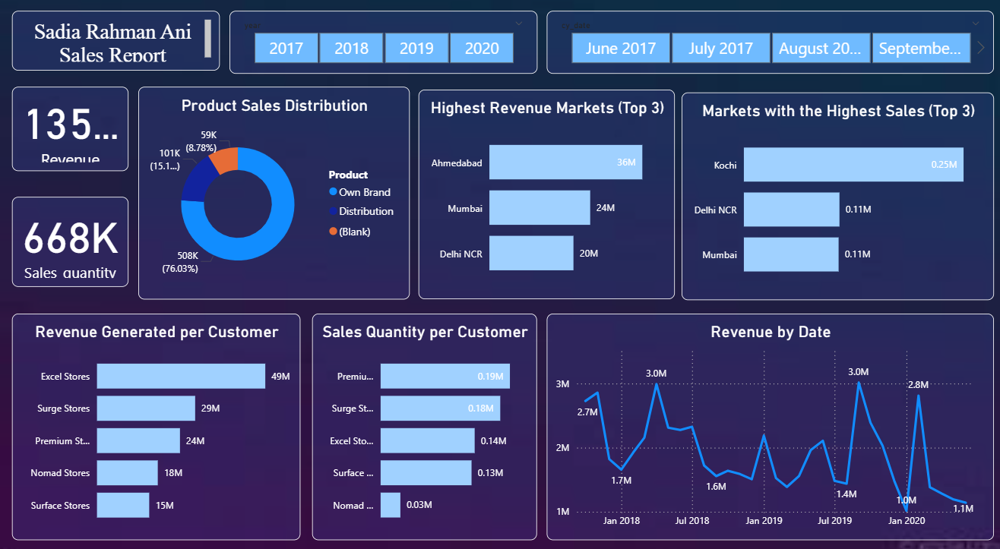

Power BI Report: Sales Performance Analysis and Insights

Overview

This Power BI report, titled "Sadia Rahman Ani Sales Report", comprehensively analyzes sales performance across various metrics and dimensions. It is designed to help stakeholders understand revenue trends, customer behavior, and market performance over time.

Key Features and Visualizations

1. Year and Month Filters

Year Selector: Users can filter data by year (2017, 2018, 2019, 2020).

Month Selector: Provides further granularity with options to analyze data by specific months.

2. KPI Metrics

Total Revenue: 135M.

Total Sales Quantity: 668K.

3. Product Sales Distribution

Displays the breakdown of sales by product categories:

Own Brand: 76.03% (508K).

Distribution: 15.1% (101K).

Others (Blank): 8.87% (59K).

4. Highest Revenue Markets (Top 3)

Ahmedabad: 36M.

Mumbai: 24M.

Delhi NCR: 20M.

5. Markets with the Highest Sales (Top 3)

Kochi: 0.25M.

Delhi NCR: 0.11M.

Mumbai: 0.11M.

6. Revenue Generated per Customer

Breakdown of revenue by customer type:

Excel Stores: 49M.

Surge Stores: 29M.

Premium Stores: 24M.

Nomad Stores: 18M.

Surface Stores: 15M.

7. Sales Quantity per Customer

Comparison of sales quantity across customer types:

Premium Stores: 0.19M.

Surge Stores: 0.18M.

Excel Stores: 0.14M.

Surface Stores: 0.13M.

Nomad Stores: 0.03M.

8. Revenue by Date

Line chart depicting revenue trends over time, highlighting peaks:

Notable peaks around 3.0M in July 2018 and July 2019.

Sharp decline to 1.0M in January 2020.

Usage Instructions

Interact with Filters: Use the year and month selectors at the top of the report to customize the time period for analysis.

Analyze KPIs: Quickly review total revenue and sales quantity for a high-level understanding of performance.

Dive into Details:

Explore product sales distribution to understand category contributions.

Examine customer and market-specific metrics to identify key revenue drivers.

Monitor trends in the "Revenue by Date" chart for seasonality or anomalies.

Insights

Market Performance: Ahmedabad leads in revenue generation, while Kochi has the highest sales quantity.

Customer Contributions: Excel Stores generate the highest revenue, while Premium Stores lead in sales quantity.

Trends Over Time: Revenue exhibits significant peaks in mid-2018 and mid-2019, with a notable drop in early 2020.
